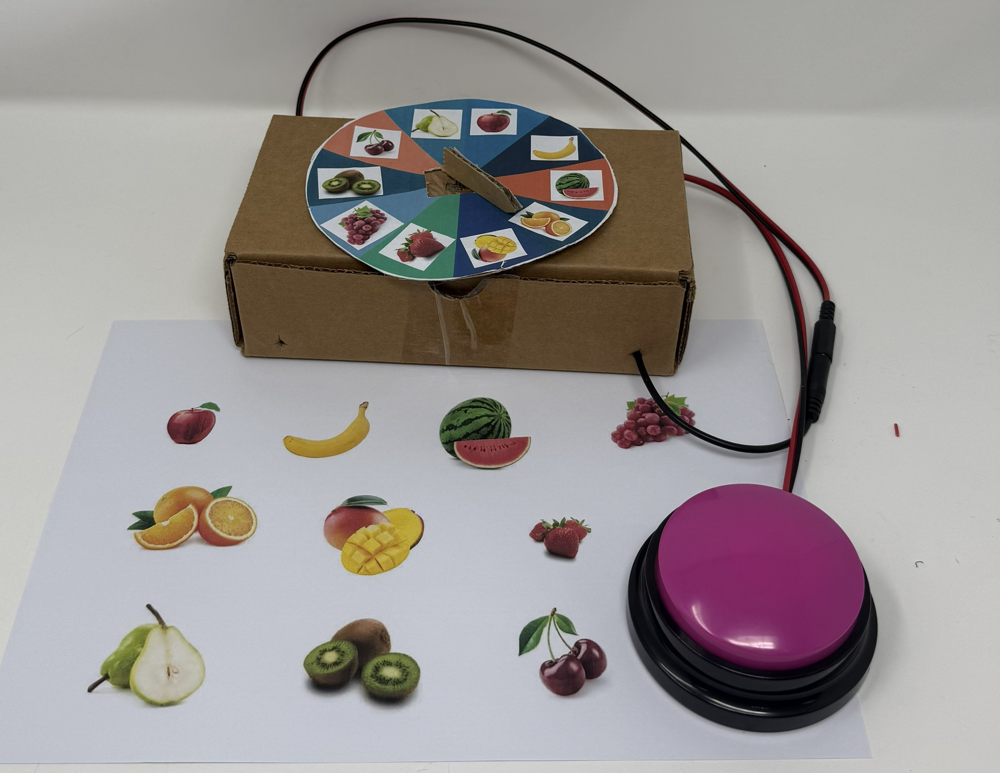

<!--- INSTRUCTIONS --->
<!--- This is a markdown template for creating the README.md file in a GitHub repository. This file is rendered and displayed automatically when someone visits the repository.

This document includes helper text that will not be displayed when rendered. Any text between the less-than sign + exclamation mark + three hyphen-minus (<!---) and matching three hyphen-minus + greater-than sign will not be displayed. This helper text can be deleted once the corresponding section is completed.

This template has a number of fields that can be searched and replaced with other text:
 - <Device_Name> Replace this with filename-friendly version of the device with underscores. e.g., T4G-Adapted-Recorder-Button
 - <DeviceName> Replace this with the human-readable name of the device with spaces. e.g., Adapted RecorderButton
 - <DesignerName> Replace this with the person or organization responsible for the design. e.g., John Doe.
 - <Repository_Link> Replace this with the web address for the repository. e.g., (e.g., https://github.com/Engineering-Good/T4G-Adapted-Recorder-Button))
 - <MaterialCost> Replace this with the dollar cost and currency (SGD, USD, etc.) of the materials of the device.
 - <ShippingCost> Replace this with the dollar cost and currency (SGD, USD, etc.) of shipping the device (if possible).
 - <YEAR> year(s) of the copyright 
 
Any text that is currently holding a space / is an instruction for the person filling in the README is in all capitals, to make it easier to see them in a rendered version.
--->
<!--- delete this part after done. End --->

# Spinner Game
<!--- TITLE --->
<!--- SUMMARY --->
We’ve taken the classic "Pick and Match" game and given it a motorized upgrade! To help students move past picking only their favorite fruits, we’ve added a simple toy car motor to randomize the spinner of the choice the student picked.

With a single press of an Assistive Technology (AT) button, the motor whirls the spinner to a random fruit. It’s a fun, high-cause-and-effect way to challenge students to match various fruits they might otherwise skip.

This setup is perfect for classroom use and easily connects to an [Adapted Recorder Button](https://github.com/Engineering-Good/T4G-Adapted-Recorder-Button) for accessibility.

The current version of the device (v1.0) has been built and user tested.

## How to Obtain the Device

### 1. Do-it-Yourself (DIY) or Do-it-Together (DIT)

This is an open-source assistive technology, so anyone is free to build it. All of the files and instructions required to build the device are contained within this repository. Refer to the Maker Guide below.

### 2. Get Involved: Requests & Volunteering

- Need this device? If you or someone you know could benefit from the TEMPLATE, please send us an email at [contactus@engineeringgood.org](mailto:contactus@engineeringgood.org). We also invite you to share your journey with us! Tell us your stories about the device and feedback help us make our assistive tech even better!

- Want to help? We are always looking for volunteers to help build these devices for the community. If you have the skills and want to contribute, please contact us via email at [contactus@engineeringgood.org](mailto:contactus@engineeringgood.org).

## Build Instructions

### 1. Read through the Maker Guide

The [Maker Guide](/documentation/Product_Manual_Spinner_Game.pdf)  contains all the necessary information to build this device, including tool lists, assembly instructions, and testing.

### 2. Order the Off-The-Shelf Components

The [Bill of Materials](/documentation/Spinner_Game_BOM.csv) lists all of the parts and components required to build the Template Device.

### 3. Assemble the Template Device

Reference the Assembly Guide section of the [Maker Guide](/documentation/Product_Manual_Spinner_Game.pdf) for the tools and steps required to build each portion.

## How to improve this Device

As open source assistive technology, you are welcomed and encouraged to improve upon the design.

## Files

### Documentation

| Document             | Version | Link |
|----------------------|---------|------|
| Maker Guide          | 1.0     | [Spinner_Game_Guide](/documentation/Product_Manual_Spinner_Game.pdf)     |
| Bill of Materials    | 1.0     | [Spinner_Game_Bill_of_Materials](/documentation/Spinner_Game_BOM.csv)     |
| User Guide           | 1.0     | [Spinner_Game_User_Guide](/documentation/Product_Manual_Spinner_Game.pdf)    |
| Changelog            | 1.0     | [Spinner_Game_Change_Log](/documentation/CHANGES.txt)     |

## License

Copyright (c) 2024 Engineering Good.

This repository describes Open Hardware:

- Everything needed or used to design, make, test, or prepare the Template is licensed under the [CERN 2.0 Weakly Reciprocal license (CERN-OHL-W v2) or later](https://cern.ch/cern-ohl ).
- All software is under the [GNU General Public License v3.0 (GPL-3.0)](https://www.gnu.org/licenses/gpl.html).
- Accompanying material such as instruction manuals, videos, and other copyrightable works that are useful but not necessary to design, make, test, or prepare the Playback Switch are published under a [Creative Commons Attribution-ShareAlike 4.0 license (CC BY-SA 4.0)](https://creativecommons.org/licenses/by-sa/4.0/).

You may redistribute and modify this documentation and make products using it under the terms of the [CERN-OHL-W v2](https://cern.ch/cern-ohl).
This documentation is distributed WITHOUT ANY EXPRESS OR IMPLIED WARRANTY, INCLUDING OF MERCHANTABILITY, SATISFACTORY QUALITY AND FITNESS FOR A PARTICULAR PURPOSE.
Please see the CERN-OHL-W v2 for applicable conditions.

Source Location: <https://github.com/Engineering-Good/T4G-Template>

----

<!-- ABOUT EG START -->
## About Engineering Good

- Website: [https://www.engineeringgood.org](https://www.engineeringgood.org)
- GitHub: [Engineering Good](https://github.com/Engineering-Good)
- Instagram: [@engineeringgood](https://www.instagram.com/engineeringgood/)
- Facebook: [engineeringgood](https://www.facebook.com/engineeringgood.org/)
- LinkedIn: [engineeringgood](https://www.linkedin.com/company/engineeringgood/?originalSubdomain=sg)
- Thingiverse: [engineeringgood](https://www.thingiverse.com/engineeringgood/designs)
- Printables: [@engineeringg_4351657](https://www.printables.com/@engineeringg_4351657)

### Contact Us

For technical or non-techical questions, to get involved, or to share your experience we encourage you to 
- Visit [our website](https://www.engineeringgood.org/)
- Vontact us via [contact us form](https://www.engineeringgood.org/contact-faq/)
- Email us at [contactus@engineeringgood.org](mailto:contactus@engineeringgood.org)
- Volunteering Opportunities [working in progress](https://www.notion.so/engineeringgood/Volunteering-Opportunities-2025-ffa3d3ec8bb34ac7a672f5c10ee8177b)
<!-- ABOUT EG END -->
